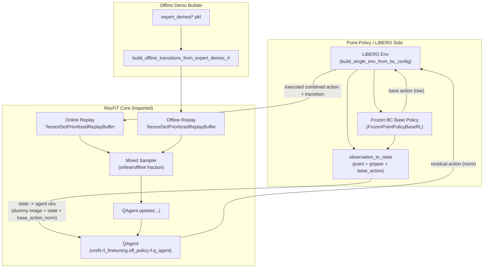
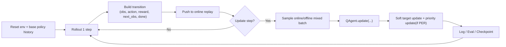

# Point-Policy RL Architecture (`_rl`)

This document visualizes the current residual RL structure in
`Point-Policy_codex_libero/point_policy_rl`.

## 1) Runtime Dataflow (ResFiT Core Backend)

## 2) Training Pipeline

## 3) Offline Transition Modes

`point_policy_rl/offline_demo_builder_rl.py` supports:

- `base_action_mode=demo_delta`
  Uses demo frame deltas as base action approximation.
- `base_action_mode=bc_track_delta`
  Uses frozen BC prediction-derived track delta as base action approximation.
- `transition_action_mode=residual_zero`
  Stores zero residual action in replay (residual target = 0).
- `transition_action_mode=combined_base`
  Stores combined/base action in replay (useful for ResFiT-style combined-action storage).

## 4) Main Files

- `point_policy_rl/train_resfit_residual_td3_rl.py`
  Main trainer using ResFiT `QAgent`, TorchRL replay, MultiStep transform.
- `point_policy_rl/offline_demo_builder_rl.py`
  Demo pkl to replay transition conversion.
- `point_policy_rl/base_policy_adapter_rl.py`
  Frozen Point-Policy BC checkpoint loader and inference adapter.
- `point_policy_rl/env_bridge_rl.py`
  LIBERO environment construction and state feature extraction bridge.
- `point_policy_rl/experiments_rl/libero_spatial/slurm/train_resfit_residual_td3_rl.sbatch`
  Spatial suite launcher.
- `point_policy_rl/experiments_rl/libero_object/slurm/train_resfit_residual_td3_rl.sbatch`
  Object suite launcher.

## 5) Current Design Note

`resfit` RL core is reused directly, while env/base-policy integration remains
Point-Policy-specific through `_rl` adapters.
