# Point-Policy Residual RL 재구성 가이드 (`_rl`)

이 문서는 `point_policy_rl`의 현재 `_rl` 구현을 처음부터 다시 만들 수 있도록 작성한 재구성용 문서다.

기준 구현:
- `point_policy_rl/train_resfit_residual_td3_rl.py:1476`
- `point_policy_rl/base_policy_adapter_rl.py:9`
- `point_policy_rl/env_bridge_rl.py:279`
- `point_policy_rl/offline_demo_builder_rl.py:172`
- `/sjw_alinlab2/home/sanghyeok/residual-offpolicy-rl/resfit/rl_finetuning/off_policy/rl/q_agent.py:21`
- `point_policy/suite/libero_spatial.py`

---

## 1) 문서 목적 / 범위 / 비범위

### 목적
- Frozen BC base + residual off-policy RL 결합 구조를 동일하게 재구성한다.
- 구현 의사결정을 남기지 않고, 코드 경로/입출력 계약/수식/실행 절차를 고정한다.

### 범위
- 학습 루프, 리플레이, 오프라인 데모 변환, loss/update, 로깅, 체크포인트.
- 현재 런타임 호환 패치까지 포함한 실동작 기준.

### 비범위
- Point-Policy BC 자체 재학습 로직 변경.
- LIBERO/robosuite 원본 코드 영구 수정.
- 논문 성능 재현 튜닝 전체 탐색.

### API 정책
- 런타임 API 변경 없음.
- 체크포인트 포맷 변경 없음.
- 문서는 `point_policy_rl/RECONSTRUCTION_GUIDE_RL.md` 1개를 기준으로 유지.

---

## 2) 전체 시스템 한눈에 보기

```mermaid
flowchart LR
  subgraph BC["Frozen BC Base"]
    O1["obs_t"]
    B1["FrozenPointPolicyBaseRL.act()\nbase_policy_adapter_rl.py:110"]
    B2["Point-Policy 내부 history/chunk"]
    B3["action_dict"]
    O1 --> B1 --> B2 --> B3
  end

  subgraph DEC["Point -> Robot Action"]
    D1["env.point2action(action_dict)\npoint_policy/suite/libero_spatial.py"]
    D2["rule-based pose/gripper decode"]
    D3["a_base_raw (7D)"]
    B3 --> D1 --> D2 --> D3
  end

  subgraph RL["Residual ResFiT QAgent"]
    S1["observation_to_state(obs, base_action)\nenv_bridge_rl.py:332"]
    S2["state -> agent obs\n(train script bridge)"]
    A1["q_agent.act -> residual_norm"]
    A2["a_final = denorm(clip(norm(base)+residual))\ntrain_resfit_residual_td3_rl.py:1822"]
    D3 --> S1 --> S2 --> A1 --> A2
  end

  subgraph BUF["Replay + Update"]
    R1["online replay"]
    R2["offline demo replay"]
    R3["mixed sampling"]
    R4["q_agent.update"]
    A2 --> R1
    R2 --> R3 --> R4
    R1 --> R3
  end
```



핵심 분리:
- base 정책은 sequence-aware(history/chunk).
- residual RL은 step-wise state 보정기.

---

## 3) 엔드투엔드 데이터 플로우

### Stage A: 초기화
- 입력:
`args`, BC ckpt 경로, ResFiT 코드 루트.
- 처리:
호환 패치 적용 후 env/base/QAgent/replay 생성.
- 출력:
`run_dir`, `run_meta.json`, `online_rb`, `offline_rb`.

코드:
- `point_policy_rl/train_resfit_residual_td3_rl.py:1476`
- `point_policy_rl/train_resfit_residual_td3_rl.py:1600`
- `point_policy_rl/train_resfit_residual_td3_rl.py:1739`

### Stage B: 매 env step rollout
- 입력:
`obs_t`, `base internal buffer`, `q_agent`.
- 처리:
1. `base_action_dict = train_base.act(obs_t, step_in_ep, global_step)`
2. `a_base_raw = env.point2action(base_action_dict)`
3. `state_t = observation_to_state(obs_t, ..., a_base_raw)`
4. residual 추론(또는 warmup random)
5. `a_final = denorm(clip(norm(a_base_raw)+residual))`
6. `env.step(a_final)`
7. sparse reward 부여
8. `next_base_action` 계산 후 `next_state` 구성
9. transition 저장
- 출력:
`online_rb`에 transition 추가, episode 통계 갱신.

코드:
- `point_policy_rl/train_resfit_residual_td3_rl.py:1788`
- `point_policy_rl/train_resfit_residual_td3_rl.py:1822`
- `point_policy_rl/train_resfit_residual_td3_rl.py:1843`
- `point_policy_rl/train_resfit_residual_td3_rl.py:1867`

### Stage C: off-policy update
- 입력:
online/offline replay batch.
- 처리:
mixed batch 샘플 -> `q_agent.update` -> priority 업데이트(가능 시).
- 출력:
`critic_loss`, `actor_loss`, `batch_reward` 등 metrics.

코드:
- `point_policy_rl/train_resfit_residual_td3_rl.py:1322`
- `point_policy_rl/train_resfit_residual_td3_rl.py:1902`

### Stage D: 로깅/평가/저장
- 입력:
metrics, step.
- 처리:
`train_log.csv`, `eval_log.csv`, W&B, `snapshot/latest.pt` 저장.
- 출력:
재현 가능한 산출물.

코드:
- `point_policy_rl/train_resfit_residual_td3_rl.py:1924`
- `point_policy_rl/train_resfit_residual_td3_rl.py:1945`
- `point_policy_rl/train_resfit_residual_td3_rl.py:1965`

---

## 4) 모듈별 책임과 인터페이스

### 4.1 `point_policy_rl/base_policy_adapter_rl.py`

#### 책임
- BC 체크포인트를 로드하고, freeze 상태로 `act()`만 제공.

#### 입력 / 처리 / 출력
- 입력:
`repo_root`, `bc_weight`, `device`.
- 처리:
Hydra config 로드 -> `BCAgent` 생성 -> snapshot 로드 -> `buffer_reset()`.
- 출력:
`act(observation, step, global_step) -> action_dict`.

코드:
- 생성자 및 cfg 로드: `point_policy_rl/base_policy_adapter_rl.py:12`
- agent build/load: `point_policy_rl/base_policy_adapter_rl.py:74`
- 추론 API: `point_policy_rl/base_policy_adapter_rl.py:110`

### 4.2 `point_policy_rl/env_bridge_rl.py`

#### 책임
- BC hydra config 기반으로 LIBERO env를 1개 생성.
- RL state 벡터를 point/features/base_action으로 구성.

#### 입력 / 처리 / 출력
- 입력:
`cfg`, `suite/task override`, `seed`, `max_episode_len`.
- 처리:
`build_single_env_from_bc_config()`로 make kwargs 구성 및 filter.
- 출력:
`(env, task_desc, pixel_key, low, high, suite_name)`.

코드:
- env 생성: `point_policy_rl/env_bridge_rl.py:279`
- state 구성: `point_policy_rl/env_bridge_rl.py:332`
- action clip: `point_policy_rl/env_bridge_rl.py:362`

### 4.3 `point_policy_rl/offline_demo_builder_rl.py`

#### 책임
- demo `.pkl`를 RL transition list로 변환.

#### 입력 / 처리 / 출력
- 입력:
`demo_root`, `suite_name`, `task_name`, `base_action_mode`, reward 설정.
- 처리:
`observations` 순회 -> step별 `state/next_state/action/reward/done` 생성.
- 출력:
`list[dict]` transitions.

코드:
- builder entry: `point_policy_rl/offline_demo_builder_rl.py:172`
- action 모드 분기: `point_policy_rl/offline_demo_builder_rl.py:214`
- transition append: `point_policy_rl/offline_demo_builder_rl.py:304`

### 4.4 `point_policy_rl/train_resfit_residual_td3_rl.py`

#### 책임
- 전체 학습 orchestration.

#### 핵심 함수
- main: `point_policy_rl/train_resfit_residual_td3_rl.py:1476`
- transition write: `point_policy_rl/train_resfit_residual_td3_rl.py:1260`
- mixed sampler: `point_policy_rl/train_resfit_residual_td3_rl.py:1322`
- qagent build: `point_policy_rl/train_resfit_residual_td3_rl.py:1355`
- evaluate: `point_policy_rl/train_resfit_residual_td3_rl.py:1407`

### 4.5 ResFiT 원본 Q/critic
- QAgent update: `/sjw_alinlab2/home/sanghyeok/residual-offpolicy-rl/resfit/rl_finetuning/off_policy/rl/q_agent.py:598`
- Critic ensemble/subset-min: `/sjw_alinlab2/home/sanghyeok/residual-offpolicy-rl/resfit/rl_finetuning/off_policy/rl/critic.py:328`

### 4.6 Point-Policy action decode
- point 정책 출력을 실제 7D 로봇 action으로 변환하는 경로는 `point_policy/suite/libero_spatial.py`의 `point2action` 구현이다.
- 이 경로의 gripper/pose 보정은 rule-based 성격을 포함한다.

---

## 5) 행동 생성 로직

### 핵심 원칙
- Point-Policy history/chunk는 base 내부에서 반영.
- residual RL은 현재 step state 기준으로만 보정.

### 수식
- `a_base_norm = normalize(a_base_raw)`
- `a_residual_norm = pi_residual(s_t)`
- `a_combined_norm = clip(a_base_norm + a_residual_norm, -1, 1)`
- `a_final_raw = denormalize(a_combined_norm)`

코드:
- 합성: `point_policy_rl/train_resfit_residual_td3_rl.py:1822`
- env step: `point_policy_rl/train_resfit_residual_td3_rl.py:1826`

### 입력 / 처리 / 출력
- 입력:
`obs_t`, `a_base_raw`, `q_agent`.
- 처리:
상태 구성 -> residual 추론 -> 합성/clip/denorm.
- 출력:
env에 주입하는 최종 7D action.

---

## 6) Replay / Offline 혼합 로직

### 6.1 online replay
- transition 저장 함수: `point_policy_rl/train_resfit_residual_td3_rl.py:1260`
- torchrl 미사용 fallback에서도 n-step 누적 구현:
`point_policy_rl/train_resfit_residual_td3_rl.py:1116`

### 6.2 offline replay
- 데모는 `.pkl` 포맷(`observations` list)을 직접 사용.
- RLDS 의존 없음.

코드:
- demo load: `point_policy_rl/offline_demo_builder_rl.py:195`
- transitions 반환: `point_policy_rl/offline_demo_builder_rl.py:316`

### 6.3 batch 혼합
- offline 비율은 `offline_fraction`.
- `offline_batch_size = int(batch_size * offline_fraction)`.
- 샘플링은 online/offline에서 각각 뽑아 concat.

코드:
- 비율 계산: `point_policy_rl/train_resfit_residual_td3_rl.py:1619`
- mixed sampler: `point_policy_rl/train_resfit_residual_td3_rl.py:1322`

### 6.4 주의사항
- `offline_buffer_size`는 고정된 데모 transition 개수이며 online처럼 증가하지 않는다.
- `offline_fraction=0.5`, `batch_size=256`이면 offline batch 128이 필요하므로 demo transition 수가 충분해야 한다.
- bowl task 실측(데모 50개) 기준 약 5018 transitions.

### 6.5 prioritized fallback
- torchrl unavailable이면 requested가 prioritized여도 effective는 uniform으로 강제.

코드:
- fallback 처리: `point_policy_rl/train_resfit_residual_td3_rl.py:1612`
- run_meta 기록: `point_policy_rl/train_resfit_residual_td3_rl.py:1759`

---

## 7) Loss 정의와 업데이트 로직

기준: `/sjw_alinlab2/home/sanghyeok/residual-offpolicy-rl/resfit/rl_finetuning/off_policy/rl/q_agent.py`

### 7.1 critic objective

수식:
- `a' = clip(a_base_{t+1} + pi_target(s_{t+1}), -1, 1)`
- `discount_eff = gamma_n * nonterminal`
- `y = r + discount_eff * Q_target_min_subset(s_{t+1}, a')`
- `L_critic = E[(Q(s_t, a_t) - y)^2]`

코드 매핑:
- target action 결합: `q_agent.py:326`
- target q 계산: `q_agent.py:333`
- td error/mse: `q_agent.py:377`
- `discount_eff` 구성: `q_agent.py:614`

### 7.2 actor objective

수식:
- `a_res = pi(s_t)`
- `a_combined = clip(a_base_t + a_res, -1, 1)`
- `L_actor = -E[Q_policy(s_t, a_combined)] + lambda * ||a_res||^2`

코드 매핑:
- combined action: `q_agent.py:443`
- actor loss base: `q_agent.py:448`
- l2 penalty: `q_agent.py:438`

### 7.3 update cadence
- env step당 update 조건 충족 시 critic 4회, actor 1회(기본).

코드:
- args defaults: `point_policy_rl/train_resfit_residual_td3_rl.py:61`
- cadence 계산: `point_policy_rl/train_resfit_residual_td3_rl.py:1778`
- update loop: `point_policy_rl/train_resfit_residual_td3_rl.py:1889`

### 7.4 reward 정책 (현재 구현)
- 성공 terminal(done & goal): `1.0`
- 실패/truncate/non-terminal: `0.0`

코드:
- online reward: `point_policy_rl/train_resfit_residual_td3_rl.py:1840`
- offline step/terminal reward 파라미터: `point_policy_rl/offline_demo_builder_rl.py:181`

---

## 8) 학습 루프 의사코드

```text
parse args
init compat patches + resfit imports
build frozen base policies (train/eval)
build train/eval env
init q_agent + replay buffers
build offline transitions and preload offline replay
save run_meta

reset env
for step in [1..num_steps]:
  a_base = frozen_base.act(obs)
  state = observation_to_state(obs, a_base)

  if step <= warmup:
    residual = Uniform[-random_action_noise_scale, +random_action_noise_scale]
  else:
    residual = q_agent.act(state)

  a_final = denorm(clip(norm(a_base) + residual))
  next_obs, done = env.step(a_final)

  reward = 1.0 if done and goal_achieved else 0.0

  if done: next_base = zeros
  else: next_base = frozen_base.act(next_obs)

  next_state = observation_to_state(next_obs, next_base)
  add_transition(online_rb, state, a_final, reward, next_state, done)

  if len(online_rb) >= warmup and step % update_every == 0:
    repeat num_updates_per_iteration times:
      batch = sample_mixed(online_rb, offline_rb)
      q_agent.update(batch, update_actor=delayed_rule)
      if prioritized enabled: update priorities

  periodic train log / eval / checkpoint

  if done: reset env + base episode buffer

save latest checkpoint
finish wandb
```

---

## 9) 현재 하이퍼파라미터 스냅샷

### Snapshot A: 실제 실행 런(legacy 설정)
기준 파일:
`point_policy/exp_local_rl/2026.02.14/residual_td3_libero_spatial_rl/141311_sjw_alinlab_ep3000_resfit_0214_044521/run_meta.json`

| Key | Value |
|---|---|
| `steps` | `2000000` |
| `env_max_episode_len` | `3000` |
| `batch_size` | `256` |
| `buffer_size` | `300000` |
| `n_step` | `3` |
| `gamma` | `0.99` |
| `num_updates_per_iteration` | `4` |
| `actor_updates_per_iteration` | `1` |
| `offline_fraction` | `0.1` |
| `offline_max_demos` | `1` |
| `offline.transitions` | `97` |
| `offline_batch_size / online_batch_size` | `25 / 231` |
| `sampling_strategy` requested/effective | `prioritized_replay / uniform` |
| `critic_target_tau` | `0.01` |
| `num_q_heads` | `10` |
| `policy_gradient_type` | `ensemble_mean` |
| `stddev_max/min` | `0.1 / 0.1` |
| `random_action_noise_scale` | `1.0` |
| `residual_action_scale` | `1.0` |

### Snapshot B: 제출 프로파일(ResFiT 정합 강화)
제출 커맨드 인자 프로파일:
- `--offline-max-demos 50`
- `--offline-fraction 0.5`
- `--critic-target-tau 0.005`
- `--residual-action-scale 0.2`
- `--random-action-noise-scale 0.2`
- `--stddev-max 0.025 --stddev-min 0.025`
- `--sampling-strategy uniform`
- `--env-max-episode-len 3000`

---

## 10) 실행 재현 절차

### 10.1 준비
1. repo 이동:
`cd /sjw_alinlab2/home/sanghyeok/Point-Policy_codex_libero`
2. BC ckpt 확인.
3. `resfit_root` 확인:
`/sjw_alinlab2/home/sanghyeok/residual-offpolicy-rl`

### 10.2 SLURM 제출
기본 스크립트:
`point_policy_rl/experiments_rl/libero_spatial/slurm/train_resfit_residual_td3_rl.sbatch`

예시:
```bash
cd /sjw_alinlab2/home/sanghyeok/Point-Policy_codex_libero
BC_WEIGHT=/path/to/100000.pt \
RUN_NAME=repro_resfit_rl \
WANDB_ENABLE=1 WANDB_MODE=online \
EXTRA_ARGS='--offline-max-demos 50 --offline-fraction 0.5 --critic-target-tau 0.005 --residual-action-scale 0.2 --random-action-noise-scale 0.2 --stddev-max 0.025 --stddev-min 0.025 --sampling-strategy uniform --env-max-episode-len 3000' \
sbatch -p sjw_alinlab point_policy_rl/experiments_rl/libero_spatial/slurm/train_resfit_residual_td3_rl.sbatch
```

### 10.3 진행 모니터링
- queue: `squeue -j <JOB_ID>`
- accounting: `sacct -j <JOB_ID> --format=JobID,State,ExitCode,Elapsed -n`
- logs:
`point_policy_rl/experiments_rl/libero_spatial/slurm_logs/pp-libsp-resfit_<JOB_ID>.out`
`point_policy_rl/experiments_rl/libero_spatial/slurm_logs/pp-libsp-resfit_<JOB_ID>.err`

### 10.4 eval video 저장
- 평가 스크립트:
`point_policy_rl/eval_residual_td3_rl.py`
- 영상 옵션:
`--save-video --video-dir <dir> --video-fps 20 --video-render-size 256`

코드:
- args: `point_policy_rl/eval_residual_td3_rl.py:44`
- mp4 저장: `point_policy_rl/eval_residual_td3_rl.py:286`

---

## 11) 검증 체크리스트

재현 성공 판정 기준:
- `run_meta.json` 생성.
- `train_log.csv` 생성.
- `eval_log.csv` 생성.
- `snapshot/latest.pt` 생성.
- W&B run 생성.

값 일치 확인:
- `run_meta.json`의 `offline.fraction_applied`가 의도값과 일치.
- `run_meta.json`의 `replay.sampling_strategy_effective` 확인.
- `train_log.csv`에서 warmup 이후 `num_updates_done > 0`.
- `eval_log.csv`가 `eval_every` 주기로 누적.

---

## 12) 실패 / 예외 대응 매뉴얼

### 12.1 prioritized_replay -> uniform fallback
- 증상:
prioritized 요청했는데 실제는 uniform.
- 원인:
torchrl unavailable 또는 prioritized init 실패.
- 확인:
`run_meta.json.replay.sampling_strategy_effective`.
- 코드:
`point_policy_rl/train_resfit_residual_td3_rl.py:1612`, `point_policy_rl/train_resfit_residual_td3_rl.py:1655`.

### 12.2 executing action in terminated episode
- 증상:
`ValueError: ... terminated episode`.
- 대응:
강제 terminal transition으로 변환 후 reset.
- 코드:
`point_policy_rl/train_resfit_residual_td3_rl.py:1830`.

### 12.3 debug partition time limit
- 증상:
`TIMEOUT` 종료.
- 대응:
`latest.pt`와 로그 기준으로 재제출.
- 분기:
`TIMEOUT`과 `COMPLETED`를 `sacct`로 분리.

### 12.4 offline 부족으로 50:50 미적용
- 증상:
offline fraction을 0.5로 줬는데 실제 샘플이 online 위주.
- 원인:
offline transition 개수가 `offline_batch_size` 미만.
- 대응:
`--offline-max-demos` 상향, demo 파일 coverage 확인.

---

## 13) Known Limitations 및 개선 포인트

현재 제한:
- residual RL 입력은 step-wise state이며 base의 long-context를 직접 공유하지 않음.
- replay backend가 환경 의존적으로 바뀔 수 있음(prioritized 실효성).
- sparse reward라 성공 신호 희소.
- 현재 학습 스크립트는 `bc_batch=None`로 RFT 보조 BC 항 사용 안 함.

개선 포인트:
- residual 입력에 명시적 history context 추가.
- replay backend를 고정 가능하게 단순화.
- `train_log.csv`에 residual norm/clip ratio/TD stats를 추가 로깅.
- offline action mode 및 reward shaping 실험 자동화.

---

## 재구성 순서 10단계 요약

```text
1) BC checkpoint(.pt)와 hydra config를 확보한다.
2) FrozenPointPolicyBaseRL을 구현해 build/reset_episode/act 계약을 맞춘다.
3) BC config 기반으로 train/eval LIBERO env를 1개씩 생성한다.
4) observation_to_state(point, gripper, [eef], base_action) 형식을 고정한다.
5) ResFiT QAgent(residual_actor=True)를 동일 config로 초기화한다.
6) online replay와 offline replay를 만들고 n-step 로직을 보장한다.
7) rollout에서 a_final=denorm(clip(norm(a_base)+a_residual)) 합성 규칙을 적용한다.
8) off-policy update(critic 다회 + actor 지연 업데이트) 스케줄을 맞춘다.
9) run_meta/train_log/eval_log/snapshot/latest.pt 산출 규약을 맞춘다.
10) fallback/terminated/time-limit 예외 처리까지 동일하게 반영한다.
```
